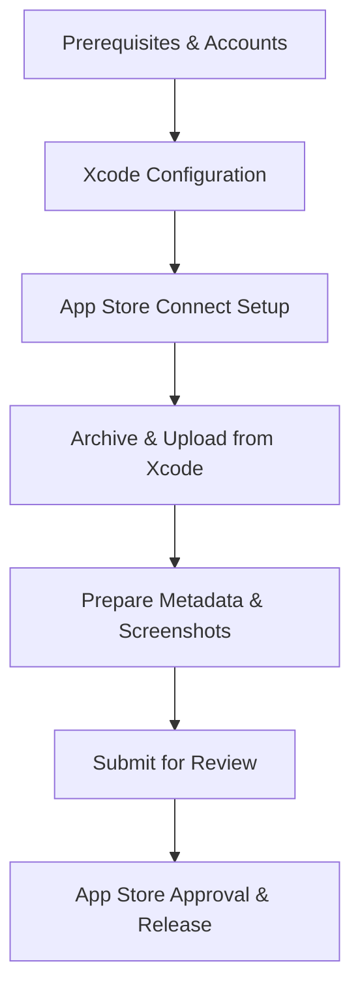

# Guide: Publishing the "Vy score" App to the Apple App Store

This guide outlines the step-by-step process of preparing, archiving, uploading, and submitting the **Vy score** (`cham_trac_nghiem`) app to the Apple App Store.

---

## 1. Prerequisites Checklist

Before you begin, ensure you have:
*   [ ] **Apple Developer Account**: Enrolled in the [Apple Developer Program](https://developer.apple.com/programs/) ($99 USD/year).
*   [ ] **Xcode**: The latest stable version installed on your Mac.
*   [ ] **App Store Connect Access**: Access to [App Store Connect](https://appstoreconnect.apple.com/) using your Apple Developer credentials.
*   [ ] **Support Website URL**: A website or simple page where users can contact you for support (required by Apple).
*   [ ] **Privacy Policy URL**: A webpage outlining how user data is handled (required by Apple). Since the app uses SwiftData locally, you can state that all data remains on-device.
*   [ ] **App Screenshots**:
    *   **iPhone 6.7" Display (e.g., iPhone 15 Pro Max / 14 Pro Max)**: 1290 x 2796 pixels (required).
    *   **iPhone 6.5" Display (e.g., iPhone 11 Pro Max / XS Max)**: 1242 x 2688 pixels (required).
    *   *Tip: Use the Xcode Simulator to capture screenshots by running the app and pressing `Cmd + S`.*

---

## 2. Step 1: Xcode Configuration

Configure your project settings inside Xcode to make sure the app signs correctly.

### Check Bundle Identifier & Versioning
1. Open the project in Xcode: Double-click [cham_trac_nghiem.xcodeproj](file:///Users/donhuvy/iCloud%20Drive%20%28Archive%29/Desktop/cham_trac_nghiem_vy/cham_trac_nghiem/cham_trac_nghiem.xcodeproj).
2. Select the top-level project file `cham_trac_nghiem` in the Project Navigator.
3. Select the target **cham_trac_nghiem** under **Targets**.
4. Select the **General** tab:
    *   **Display Name**: Ensure this is set to **Vy score** (or your preferred user-facing name).
    *   **Bundle Identifier**: Verify it is set to `com.donhuvy.cham-trac-nghiem`.
    *   **Version**: Set to `1.0.0` (for your first release).
    *   **Build**: Set to `1` (increment this number with every upload you send to App Store Connect).

### Configure Signing & Capabilities
1. Navigate to the **Signing & Capabilities** tab.
2. Check **Automatically manage signing**.
3. In the **Team** dropdown, select your Apple Developer Team account.
4. Xcode will automatically generate the provisioning profiles and signing certificates for `com.donhuvy.cham-trac-nghiem`.

> [!NOTE]
> **Privacy Permissions Confirmed**:
> Your project is already configured with the required permissions inside `project.pbxproj` for camera usage:
> *   `INFOPLIST_KEY_NSCameraUsageDescription`: *"Ứng dụng cần truy cập camera để chụp ảnh bài thi trắc nghiệm và chấm điểm tự động."*
> *   `INFOPLIST_KEY_NSPhotoLibraryUsageDescription`: *"Ứng dụng cần truy cập thư viện ảnh để chọn ảnh bài thi trắc nghiệm."*

---

## 3. Step 2: Register the App in App Store Connect

You need to register your app's bundle ID on the portal before uploading.

1. Go to [App Store Connect](https://appstoreconnect.apple.com/) and sign in.
2. Go to **My Apps** and click the **`+`** icon -> **New App**.
3. Fill out the dialog:
    *   **Platforms**: iOS.
    *   **Name**: `Vy score - Chấm Trắc Nghiệm` (needs to be unique across the App Store).
    *   **Primary Language**: Vietnamese (or English, depending on your primary audience).
    *   **Bundle ID**: Select `com.donhuvy.cham-trac-nghiem` from the dropdown list.
    *   **SKU**: A unique ID for your app (e.g., `com.donhuvy.vy-score.sku1`).
    *   **User Access**: Full Access.
4. Click **Create**.

---

## 4. Step 3: Archive and Upload the Build

Now, you will compile the production version of the app and upload it.

1. In Xcode, change the active run destination in the top toolbar from a Simulator to **Any iOS Device (arm64)**.
2. In the top menu bar, select **Product** -> **Clean Build Folder** (highly recommended before archiving).
3. Select **Product** -> **Archive**.
4. Xcode will compile the binary. Once completed, the **Organizer** window will automatically appear.
5. In the Organizer window, select your archive and click **Distribute App** (on the right sidebar).
6. Follow the wizard steps:
    *   **Destination**: App Store Connect.
    *   **Distribution Option**: Upload.
    *   **Signing**: Select your automatic developer profile.
7. Xcode will upload the build to Apple's servers. This may take a few minutes. You will see a success message once done.

---

## 5. Step 4: Configure App Store Metadata

Once the build is uploaded, it will take some time to process in the background. While it processes, set up your store listing:

1. Return to **App Store Connect** -> **My Apps** -> Select your app.
2. On the **App Store** page:
    *   **Screenshots**: Drag and drop your screenshots into the respective iPhone display tabs (6.7" and 6.5").
    *   **Promotional Text (Optional)**: A short hook.
    *   **Description**: Describe what the app does (grading multiple-choice exams using camera capture and YOLO detection, managing subjects, classrooms, students, and exporting results as PDFs/Excel).
    *   **Keywords**: Add searchable terms (e.g., `cham thi, trac nghiem, cham diem, cham bang camera, grading, exam scoring`).
    *   **Support URL**: Paste your support webpage URL.
3. Scroll down to **Build**:
    *   Click the `+` button (once processing is complete; this can take 10-20 minutes).
    *   Select your uploaded build and click **Done**.
4. In the left navigation, click **App Information**:
    *   Choose your app's **Primary Category** (e.g., Education or Utilities).
    *   Complete the **Content Rights** declaration.
    *   Complete the **Age Rating** questionnaire.
5. In the left navigation, click **App Privacy**:
    *   Enter your **Privacy Policy URL**.
    *   Indicate what data the app collects. Since the app is offline/local using SwiftData, you can check that you do not collect any user data.

---

## 6. Step 5: TestFlight (Optional but Recommended)

Before submitting to the public store, you can invite testers to try the app via TestFlight.

1. Go to the **TestFlight** tab in App Store Connect.
2. Under **External Groups**, click `+` and name it (e.g., "Internal Beta").
3. Add your email address and any other testers' emails.
4. Select the build you want to distribute.
5. Testers will receive an email invitation to download the app through the TestFlight app on iOS.

---

## 7. Step 6: Submit for Review

1. Once all metadata is completed and a build is selected, click **Save** at the top right of the page.
2. Click **Submit for Review** (or **Add for Review**).
3. If Apple asks any compliance questions (such as Export Compliance for Encryption):
    *   Since your app uses HTTPS connections or native iOS libraries, select the appropriate options (typically your app does not contain custom cryptography, so you can state no encryption features are modified).
4. Your app status will change to **Waiting for Review**.
5. App Store review usually takes between **24 to 48 hours**. Once approved, your status will change to **Ready for Sale**, and it will be live on the App Store!

> [!TIP]
> **Increasing the Build Number**:
> If you make changes and need to upload a new build, you must increment the **Build** version (e.g., from `1` to `2`) in Xcode under Target Settings, and then select **Product** -> **Archive** again. Xcode will not allow you to upload a build with a duplicate build number.
